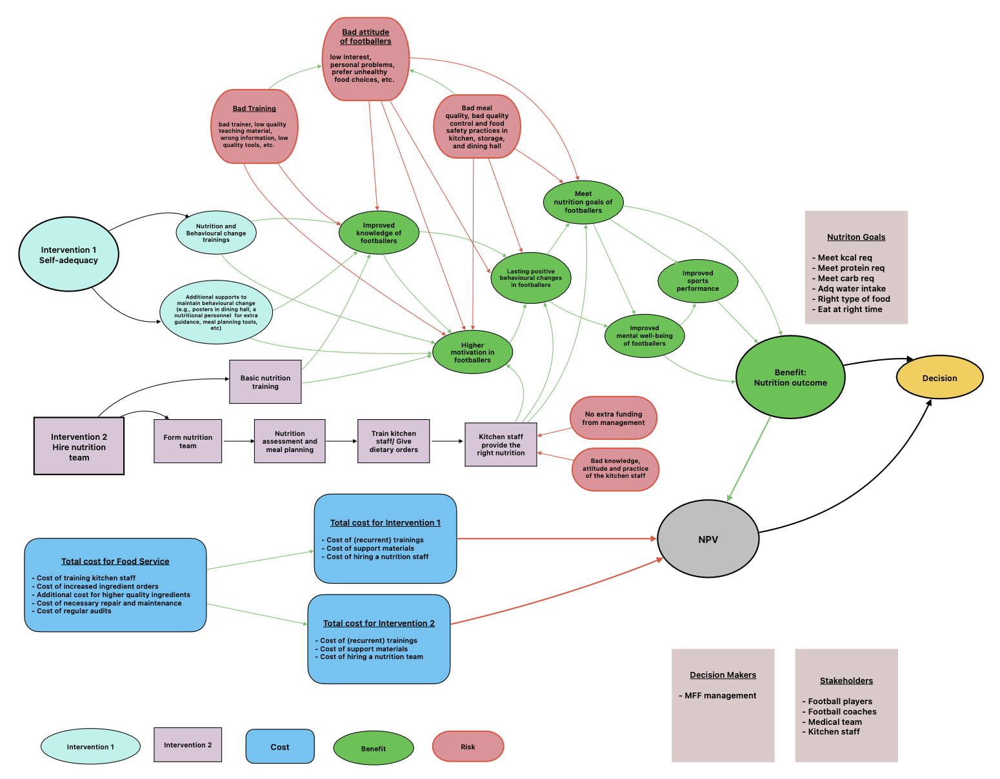

```{r setup, include=FALSE, message=FALSE, warning=FALSE}
knitr::opts_chunk$set(echo = TRUE,  message = FALSE,  warning = FALSE,  tidy = TRUE)
library(decisionSupport)
```


# Nutritional Self-reliance vs. Guided Personalized Nutrition to improve nutritional outcome of football players


<br> 

{width=100%}


---