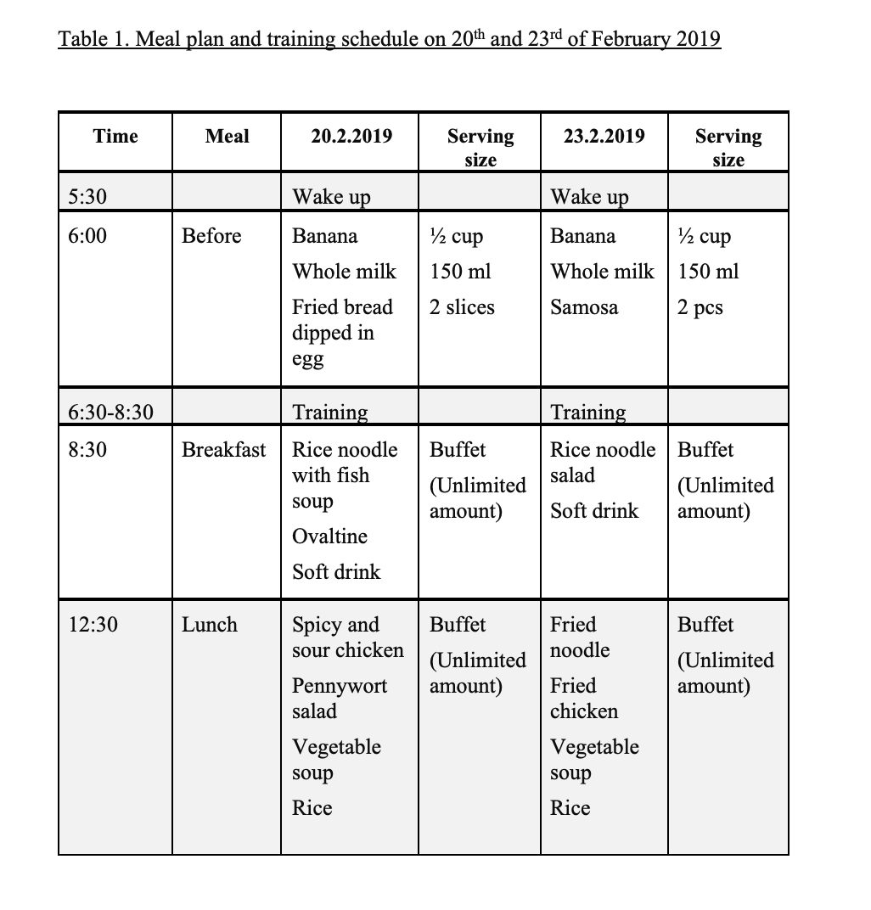
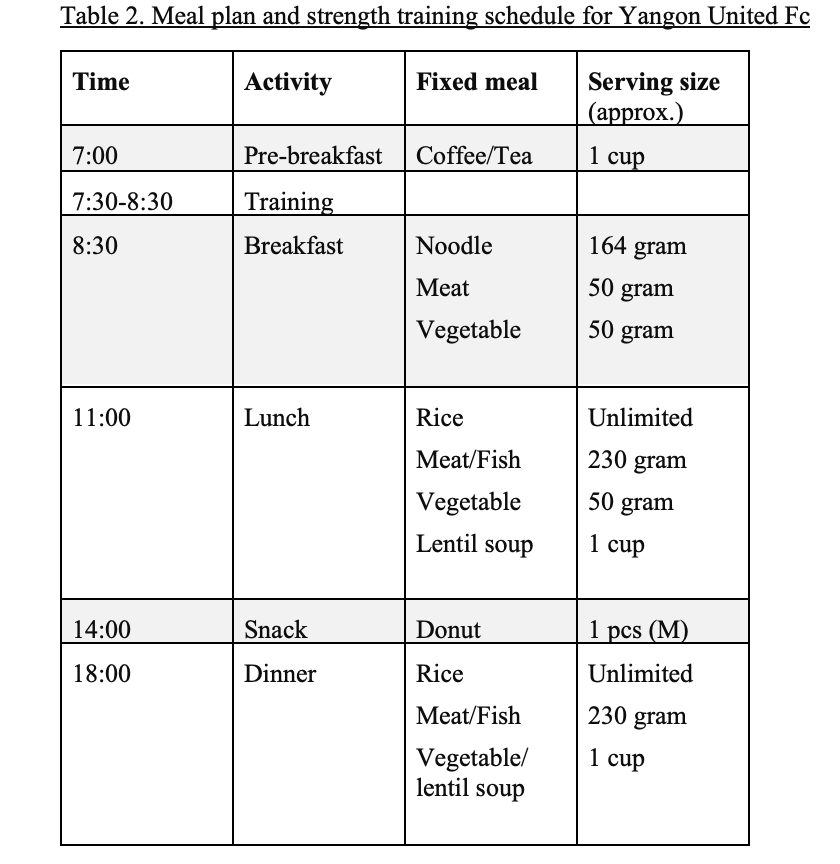

```{r setup, include=FALSE}
knitr::opts_chunk$set(echo = TRUE)
```

# Nutrition Intervention for Myanmar Football Players

## Background

Myanmar Football Federation (MFF) is the governing body of football in Myanmar. MFF headquarter and the main academy are located in Yangon, where national team players and young talents are trained. 

In 2019, the MFF technical director hired two nutritionist interns to improve diet and nutrition status of MFF players. It was the first nutrition intervention done at MFF where nutritional care was previously unprovided. As the first stage of the initial action plan, the interns were tasked to work closely with the deputy head of sports science department to figure out the adequacy of meals provided at MFF based on the training regimen. The second stage involved deciding on the suitable interventions and taking action. The interns were to accomplish the action plan within 2 months of the internship period. 

After the first two weeks of initial observations, the interns submitted a report on meal situations, nutritional adequacy, and overall food service related conditions and attitudes at MFF. The main problem faced by the interns during the initial phase was the nonacceptance of coaches regarding the nutrition intervention. To solve this problem, the technical director arranged a meeting with MFF senior management officers and head coaches. The interns presented the current nutrition-related problems at MFF, and proposed possible interventions at the meeting. The proposed interventions were accepted by the director and management staff, and the interns were given free access to kitchen and food storage to conduct additional food safety assessment. Coaches and other staff were more cooperative after the meeting, and the interns were able to continue to the phase 2 of action plan- the implementation.

The interventions were divided into two levels: 

Level 1- a series of much-needed immediate interventions to be done by the interns within two months

Level 2- a long-term intervention to ensure good and systematic nutritional care at MFF

For the level 2, the interns proposed improving the nutritional self-reliance of MFF players by means of nutrition education. A nutrition guide was to be developed by the intern, and to be translated by MFF staff after approval from technical director and sports science team. The MFF medical team was to collaborate with the intern remotely (after internship ended) to give nutrition lessons to players and coaches based on the guide developed. 

However, the MFF management and coaches proposed to hire a permanent nutritionist, rather than improving the players' nutritional self-reliance. Their reasoning was the players' schedule were already too tight with training and school, and they would not be able to spare extra time or energy on learning about nutrition. On the other hand, the interns insisted nutrition education was important since the players only resided at the academy during the training period (around 6 months before international competition), and they would go back to their respective clubs- where they wouldn't get nutritional care- after the competitions. 

The director decided a guide book would serve as a bridge before a nutritionist can be hired, since the interns will be leaving in 2 months for further clinical training. The interns continued with the action plan without change. The nutrition guide was finished and passed over to the medical team but no follow up was done due to nonacceptance by the players and coaches. Thus, the decision was left unmade in 2019, and the level 2 action plan was not achieved.  

Now, I plan to use the decision analysis method to clearly identify the best intervention option- improve nutritional self-reliance of the MFF players or hire a sports nutritionist to do personalized nutritional care in a way that no self-effort from players will be needed. 

## Part 1: The initial observation of nutrition-related conditions and interventions at MFF

The overall nutrition situations at MFF and initial interventions done are discussed in this section. These situations and interventions will form input parameters for the decision analysis in Part 2. The understanding of nutrition problems and relevant interventions will also justify why I set certain estimate ranges for some input variables of the decision model. 

We will look at the general nutrition needs for football players and see if the football players at MFF received adequate nutrition as per the guidelines. 

## Nutrition Needs for football players 

### Carbohydrate

Carbohydrates are stored as glycogen in the muscles and liver, and also found in the bloodstream as blood glucose. Carbohydrates are the major energy source. As the duration of training increases, muscle glycogen level decreases, causing muscles to take up glycogen from the bloodstream. Liver will then releases stored glycogen to the bloodstream to prevent low blood sugar level. If the carbohydrate intake is not enough, the body will convert protein and fat for energy. Thus, care should be exercised in managing appropriate carbohydrate intake and timing for atheletes (Skolnik and Chernus, 2010). 

Pre-exercise meals should be taken approximately 4 to 6 hours before exercise, as carbohydrates need at least 4 hours to be digested and stored in the liver and muscle as glycogen (Kreider et al., 2009). A light protein and carbohydrate snacks should be consumed 30 to 60 minutes before exercise to maintain carbohydrate availability throughout the exercise and to increase the anaerobic capacity (Siegel, 2007), and 1-1.5g/kg body weight of high GI carbohydrate foods should be consumed immediately after exercise to replenish glycogen storage (Skolnik and Chernus, 2010).

Consumption of a mixture of various carbohydrates rather than glucose alone can enhance absorption and improve energy availability for muscles (Jentjens et al, 2006).

### Protein	 
	
It is important to choose high quality proteins- fish, egg, low fat milk, and skinless chicken- to improve training, recovery and increase protein synthesis (Driskell and Wolinsky, 2000). Both fast-acting and slow-acting amino acids are required for post-exercise muscle repair (Skolnik and Chernus, 2010). 

According to 2012 strength training recommendations, 6 grams of protein should be consumed with 35 grams of carbohydrate prior to exercise, followed by 40 grams of protein with 6 grams of EAA during exercise. The recommendation also mentions that 20 grams of protein with 1.5g/kg body weight of carbohydrate should be ingested within 30 minutes after exercise to improve recovery (Szedlak and Robins, 2012).

Whey and casein proteins are also beneficial for protein synthesis. Whey protein enhances initial protein synthesis due to faster absorption rates, whereas casein protein enhances protein synthesis for longer duration (Hoffman, J.R., and Falvo, M. J., 2004).

### Fat
	
Athletes are advised to consume adequate amount of essential fatty acids to maintain energy balance and replenish intramuscular triacylglycerol stores (Venkatraman, Leddy and Pendergast, 2000).

### Fluid and electrolyte intake

Body fluid loss from sweat should be limited to 2% of the body weight. Urine output should be monitored for frequency (urination every 2 to 4 hours), clear color and sizable quantity. Fluid intake requirement during exercise can be assessed by measuring body weight pre- and post- exercise, and keeping track of fluid intake throughout the duration of exercise (Averbuch, 2015).

Adequate fluid intake helps to cool down the body during intense training in hot weather, and prevent dehydration. Every 1 percent loss of body fluid is accompanied with increased heart rate by 5 to 8 beats per minute, and core body temperature by 0.4 to 0.5 degrees Fahrenheit (Skolnik and Chernus, 2010). Fluid intake in the morning is also important to ensure athletes stay hydrated throughout an early workout session (Stover et al., 2006). 

If the training lasts more than 60 minutes, glucose/electrolyte solution or sport drinks should be consumed to prevent dehydration and regulate blood glucose levels (Burke, 2001). Fluid breaks should be taken every 15 to 20 minutes during training. Drinking 4 to 8 gulps of fluid per break can effectively prevent dehydration, improve performance and recovery time (Averbuch, 2015). 

Water, diluted juices, and sport drinks can be consumed as pre- and during- exercise drinks to optimize energy and carbohydrate levels. Coffee or tea can also be taken before exercise to have a caffeine-boost. Electrolytes, instant breakfast drinks, fruit smoothies and chocolate milk should be consumed after exercise to reboot protein-carbohydrate combination (Averbuch, 2015). 

### Micronutrient intake and supplementation

Adequate intake of vitamins and minerals is also crucial to enhance strength training performance, as micronutrient deficiency in athletes significantly affect exercise capacity (Kreider et al., 2010). Fiber-rich foods (fruits, vegetables) and fiber-containing supplements (e.g. Glucomannan) can help to restrict calorie intake by promoting the feeling of satiety, which is particularly helpful for weight conscious athletes on training program (Anderson et al., 2009). 
	
Study suggests that carbohydrate supplementation before, during and after training can enhance training performance, and re-synthesis of muscle glycogen leading to reduce recovery time and greater training volume (Haff et al., 2003). 
	
### Daily food intake of two MFF football teams and nutrition arrangement for other teams


#### Myanmar National Football Team (U-16)

Myanmar National Football Team (U-16) consists of 27 athletes between ages 15 to 16. All the athletes are within healthy BMI range. For U-16, strength training programs are scheduled on Tuesday and Thursday of each week. 

*Note: Fried bread dipped in egg is French toast. Meal plans for two days was copied from record provided by MFF medical team and serving size was obtained after talking to kitchen staff.*




#### Yangon United FC

Yangon United FC consists of 30 athletes between ages 20 to 31. All the athletes are within healthy BMI range. For Yangon United FC, strength training programs are scheduled on the morning of each day of the week. 




### Proposed interventions 

1.	**Body composition assessment**: Assessment of body composition, muscle and fat mass of the players are not done. Hence, daily calorie requirement for each player cannot be effectively determined. This can lead to consumption of higher or lower than recommended calorie intake. Thus, body composition assessment should be the first intervention plan towards effective nutrition management.

2.	**Diet management**: Individual calorie requirement should be evaluated, and the meal plans should be designed as per the latest nutrition recommendations.

3.	**Fluid intake management**: Daily fluid requirement is not calculated for the players. The players are not sure of how much water they drink each day, and admit forgetting to drink water sometimes. In addition to this, players are not given sport drinks or carbohydrate drinks during the long training of duration more than an hour, which calls for immediate intervention. 

4.	[**Nutrition education/ training**]{.underline}: The coaches from both teams refuse to modify the current nutrition management practice. Therefore, nutrition training should be provided for the football coaches and players.

5. **Improve food safety, hygiene and sanitation at kitchen and food storage area**: Training on food safety, hygiene and sanitation is required for all kitchen staff. Deep cleaning and disinfecting services are required. Roster for daily cleaning should be done, with a checklist for regular temperature monitoring and other special considerations. Audit should be done by a supervisor (possibly medical team)-> once a week at first, then once in two weeks or once a month or as the supervisor sees fit when things get better. 

Food preparation at the hotel is clean and proper. Food safety intervention is not needed at the hotel.

6. **Improve taste and recipe development**: Interns did the taste test at the hotel and academy. Hotel meals taste good and has a variety of buffet options. The amount is ample and food choices are suitable. But they are typical hotel meals. Slight modification of recipe is recommended. For example, instead of serving stir-fry noodle with all ingredients mixed, it can be prepared separately. One tray for noodle, one for meat, one for egg, one for vegetables. Then, the players can easily take required amount of protein or veggie. It will save cost as well-  veggie or meat will also be good to pair with rice- reduce number of dishes. And they give too much spicy fish sauce to academy kids. Need to cut down salt intake- sports science team agrees. 

The meals at academy kitchen are not good quality. Meal taste and quality needs improvement. 

7. **Proper meals for sick players**: players do not receive appropriate meals when they are sick. This can interfere with their recovery and affect performance.

#### Interventions done


## Part 2: The Decision Analysis of the Intervention Options


### References

Anderson, J., Baird, P., Davis Jr, R., Ferreri, S., Knudtson, M., Koraym, A., Waters, V. and Williams, C. (2009). Health benefits of dietary fiber. Nutrition Reviews, 67(4), pp.188-205.

Averbuch, G. (2015). Food guide for soccer. United Kingdom: Meyer & Meyer Sport.

Burke, L. (2001). Nutritional needs for exercise in the heat. Comparative Biochemistry and Physiology Part A: Molecular & Integrative Physiology, [online] 128(4), pp.735-748. Available at: <https://www.ncbi.nlm.nih.gov/pubmed/11282317>

Driskell, J. and Wolinsky, I. (2000). Energy-yielding macronutrients and energy metabolism in sports nutrition. Boca Raton: CRC Press, pp.191-212.

Haff, G., LEHMKUHL, M., MCCOY, L. and STONE, M. (2003). Carbohydrate Supplementation and Resistance Training. Journal of Strength and Conditioning Research, [online] 17(1), pp.187-196. Available at: <https://www.ncbi.nlm.nih.gov/pubmed/12580676.>

Hoffman, J. R., & Falvo, M. J. (2004). Protein – Which is Best? Journal of Sports Science & Medicine, 3(3), 118–130.

Jentjens, R., Underwood, K., Achten, J., Currell, K., Mann, C. and Jeukendrup, A. (2006). Exogenous carbohydrate oxidation rates are elevated after combined ingestion of glucose and fructose during exercise in the heat. Journal of Applied Physiology, 100(3), pp.807-816.

Kreider, R. B., Wilborn, C. D., Taylor, L., Campbell, B., Almada, A. L., Collins, R., … Antonio, J. (2010). ISSN exercise & sport nutrition review: research & recommendations. Journal of the International Society of Sports Nutrition, 7, 7. <http://doi.org/10.1186/1550-2783-7-7>

Kreider, R., Leutholtz, B., Katch, F. and Katch, V. (2009). Exercise & Sport Nutrition: Principles, Promises, Science & Recommendations. California: Fitness Technologies Press, pp.207-239.

Siegel, D. (2007). Effects of Creatine, Amino Acid, and Protein Supplementation on Performance. Journal of Physical Education, Recreation & Dance, [online] 78(6), pp.10-10. Available at: <http://www.tandfonline.com/doi/abs/10.1080/07303084.2007.10598031>

Skolnik, H. and Chernus, A. (2010). Nutrient timing for peak performance

Stover EA, Petrie HJ, Passe D, Horswill CA, Murray B, Wildman R. Urine specific gravity in exercisers prior to physical training. Appl Physiol Nutr Metab. 2006 Jun;31(3):320-7.

Szedlak, C. and Robins, A. (2012). Protein Requirements for Strength Training. Strength and Conditioning Journal, [online] 34(5), pp.85-91. Available at: <https://journals.lww.com/nsca-scj/Fulltext/2012/10000/Protein_Requirements_for_Strength_Training.14.aspx#H11-14>

Venkatraman, J., Leddy, J. and Pendergast, D. (2000). Dietary fats and immune status in athletes: clinical implications. Medicine & Science in Sports & Exercise, 32(Supplement), pp.S389-S395.


