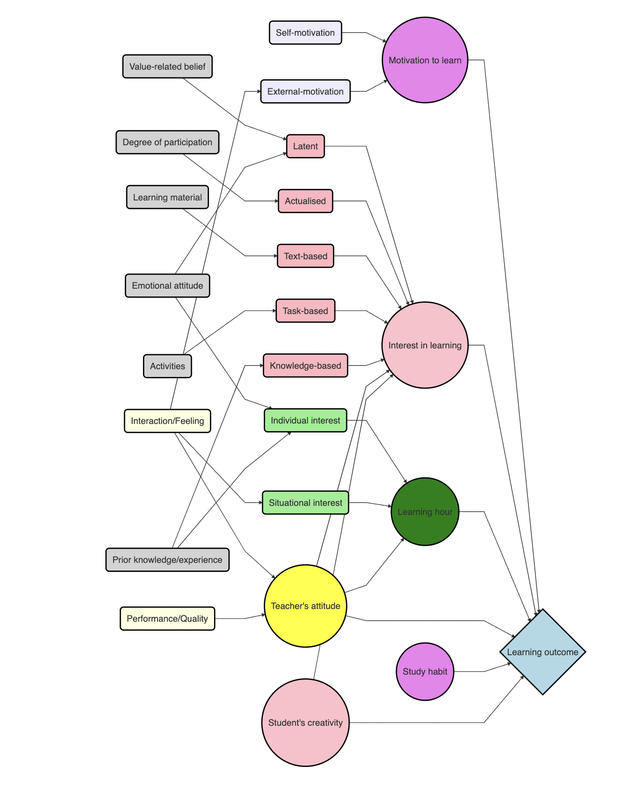
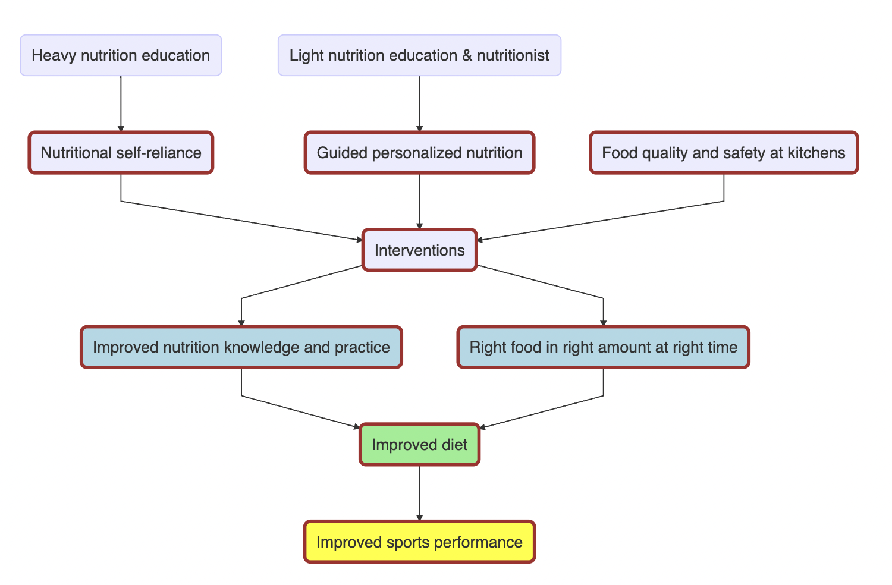

```{r setup, include=FALSE}
knitr::opts_chunk$set(echo = TRUE)
library(tidyverse)
library(DiagrammeR)
library(decisionSupport)
```

# Forming Priors

Prior distributions for our model are set based on previous literature and inputs from experts. Experts' inputs are obtained via focused group discussion and survey. 

## Stage 1: Priors from literature

The objectives of collecting prior information from literature:

- To identify variables that have direct association with the targeted outcome
- To identify the direction and degree of associations between the variables and the outcome
- To explore the changes in values of outcomes affected by different variables (when           applicable)

### Applicability and generalizability of data on our population 

The applicability and generalizability of data are determined by the extent of similarity between the study population and our population. 

#### Background info of our population

+ Location- Yangon, Myanmar
+ Population- Professional football players
+ Gender- Male and Female 
+ Age- 15 to 30
+ Education level- highschool to college level students, older players are university           graduates

#### Intervention 1: Improving Nutritional Self-reliance

+ Nutrition education (Nutrition Guide and a series of in-person classes)
    + Food groups (basic level)
    + Types of nutrients (basic level)
    + Healthy plate (basic level)
    + Macronutrient and fluid requirements (Intermediate to advance level)
    + Calculation of protein-energy/ fluid requirements (Advance level)
    + Food exchange (Advance level)

#### Intervention 2: Guided Personalized Nutrition

+ Nutrition education (a 3-hour in-person class)
    + Food groups (basic level)
    + Types of nutrients (basic level)
    + Healthy plate (basic level)
    + Macronutrient and fluid requirements (Intermediate level)
    
### Collecting Priors from Literature Review

> 1. [The influences of interest in learning and learning hours on learning outcomes
of vocational college students in Taiwan: using a teacher’s instructional attitude
as the moderator](http://wiete.com.au/journals/GJEE/Publish/vol13no3/01-Lee-Y-J.pdf)


```{r table1, tidy=FALSE, include=FALSE} 

data1 <- tribble(
  ~"Name",                  ~"Category",                          ~"Match",
  "Location",                "Taiwan",                              "Low",
  "Population",              "College students, lecturers",         "Medium",
  "Gender",                  "Male and Female",                     "High",
  "Age",                     "18 to 60",                            "Medium",
  "Education level",         "College studnets to Phd",             "Medium",
  "**Applicability**",       "**NA**",                              "**Low to Medium**"
)
knitr::kable((data1), booktabs = TRUE,
caption = 'Study Population')

```

```{r table2, tidy=FALSE, include=FALSE}
data2 <- read.table(stringsAsFactors = FALSE, header = TRUE, sep="/", text =
'Name/Category/Match
 Location/Taiwan/Low
 Population/College students, Lecturers/Medium
 Age/ 18 to 60/ Medium
 Education level/ College students to Phd/ Medium
 Applicability/ NA/ Low to Medium'
)
knitr::kable((data2), booktabs = TRUE,
caption = 'Study Population')
```

<style>
.column-left{
  float: left;
  width: 33%;
  text-align: left;
}
.column-center{
  display: inline-block;
  width: 33%;
  text-align: center;
}
.column-right{
  float: right;
  width: 33%;
  text-align: right;
}
</style>

#### $\color{brown}{\text{Study Population}}$

<div class="column-left">
**Category**

Location

Population

Age

Education level

*Applicability*
</div>

<div class="column-center">

**Data**

Taiwan

College students, Acedamic staff

18 to 60

Current students to Phd

*NA*
</div>

<div class="column-right">

**Match**

Low

Medium

Medium

Medium

*Low to Medium*

</div>

#### $\color{brown}{\text{Association between Variables and Learning Outcome}}$

<div class="column-left">
**Variable**

Interest in learning (I)

Learning hours (T)

Teacher's instructional attitude (Mo)

I*Mo

T*Mo

</div>

<div class="column-center">
**Direction and Degree of Association**

Positive, Significant

Positive, Significant

Positive, Significant

Positive, Significantly strong

Positive, Significantly strong

</div>

<div class="column-right">
**Path Coefficient Value**

0.462

0.451

0.442

0.691

0.672

</div>

<span style="color:blue">When a teacher’s instructional attitude exerts a positive extraneous effect, H1, H2 and H3 appear relatively insignificant, compared with the increased significance of H4 and H5 statistically</span>.

>2. [THE EFFECT OF TEACHER COMMUNICATION ABILITY AND LEARNING MOTIVATION ON STUDENT LEARNING OUTCOMES IN ECONOMIC LESSONS FOR CLASS XI IPS SMA EKASAKTI IN PADANG ACADEMIC YEAR 2015/2016](https://click.endnote.com/viewer?doi=10.31933%2Fjige.v1i1.532&token=WzM4NzQwODksIjEwLjMxOTMzL2ppZ2UudjFpMS41MzIiXQ.YQ_qIxckhzLvpQEiikE2Iq_-xy4)


#### $\color{brown}{\text{Study Population}}$

<div class="column-left">
**Category**

Location

Population

Age

Education level

*Applicability*
</div>

<div class="column-center">
**Data**

Indonesia

High school student

16 to 17

Grade 11 

*NA*
</div>

<div class="column-right">
**Match**

Medium

Medium

Medium

Medium

*Medium*
</div>

#### $\color{brown}{\text{ Association between Variables and Learning Outcome }}$

<div class="column-left">
**Variable**

Teacher's communication skills (CS)

Student's motivation to learn (LM)

CS*LM

</div>

<div class="column-center">
**Direction and Degree of Association**

Positive, Significant

Positive, Significant

Positive, Significant

</div>

<div class="column-right">
**R-square Value**

NA

NA

0.216

</div>

#### $\color{brown}{\text{Changes in Value of Outcome}}$

Every  1  point  increase  in  communication  will  be  followed  by  an  increase  in learning  outcomes  of  0.155  and  every  1  point  increase  in  learning  motivation  will be followed by an increase in learning outcomes of 0.108.

Communication skills and learning motivation contribute  to  the  value  of  student  learning  outcomes  by  21.60%,  while  the  remaining 78.40% is contributed by other factors not examined in this study. Other variables  that  were  not  examined  were  internal  factors  (health,  intelligence,  interests)  and external factors (family and community environment).


> 3. [The  Correlation of  Motivation and  Habit with  Learning  Outcomes in New Normal Era](https://click.endnote.com/viewer?doi=10.25217%2Fji.v8i1.2749&token=WzM4NzQwODksIjEwLjI1MjE3L2ppLnY4aTEuMjc0OSJd.4RX3NsJrGDLYnH_KUh446TFrTj4)


#### $\color{brown}{\text{Study Population}}$

<div class="column-left">
**Category**

Location

Population

Age

Education level

*Applicability*
</div>

<div class="column-center">
**Data**

Indonesia

High school student

16 to 17

Grade 11 

*NA*
</div>

<div class="column-right">
**Match**

Medium

Medium

Medium

Medium

*Medium*
</div>

#### $\color{brown}{\text{ Association between Variables and Learning Outcome }}$

<div class="column-left">
**Variable**

Motivation (M) (self/external)

Habit (H)

M*H
</div>

<div class="column-center">
**Direction and Degree of Association**

Positive, Significant, Weak

Positive, Significant, Weak

Positive, Significant, Weak
</div>

<div class="column-right">
**R-square Value**

0.217

0.235

0.302
</div>

>4. [THE EFFECT OF STUDENT'S CREATIVITY AND LEARNING INTEREST ON LEARNING ACHIEVEMENT IN ECONOMIC STUDENTS CLASS XI IPS SMA EKASAKTI PADANG](https://click.endnote.com/viewer?doi=10.31933%2Fjige.v1i1.536&token=WzM4NzQwODksIjEwLjMxOTMzL2ppZ2UudjFpMS41MzYiXQ.Moq4gCtdC6cyrMugQKorDQsS9rU)

#### $\color{brown}{\text{Study Population}}$

<div class="column-left">
**Category**

Location

Population

Age

Education level

*Applicability*
</div>

<div class="column-center">
**Data**

Indonesia

High school student

16 to 17

Grade 11 

*NA*
</div>

<div class="column-right">
**Match**

Medium

Medium

Medium

Medium

*Medium*
</div>

#### $\color{brown}{\text{ Association between Variables and Learning Outcome }}$

<div class="column-left">
**Variable**

Creativity (X1)

Interest in Learning (X2)

X1*X2
</div>

<div class="column-center">
**Direction and Degree of Association**

Positive, Significant

Positive, Significant

Positive, Significant, Strong
</div>

<div class="column-right">
**R-square Value**

NA

NA

0.503
</div>

#### $\color{brown}{\text{Changes in Value of Outcome}}$

Student's  creativity, interest, and creativity and interest  have an  effect  of  14%, 41.8% and 50.3%  on  student  achievement  in  economics  subjects  for class  XI  Social  Sciences SMA  Ekasakti  Padang, the remaining 49.7% is influenced by several other  factors. 


#### $\color{green}{\text{Generate Initial Model}}$

We chose 4 papers as reference for our initial priors. Our search focused on the papers that studied variables with potential impact on learning outcome in a traditional classroom setting. Intervention studies (novel teaching method, learning environment, hybrid classroom, etc) were excluded. 

None of the selected studies has a population closely matched (high applicability) to our target population. Hence, the papers' findings cannot be applied directly to our model, but they will be useful in building the basic framework of the model. Paper 1, 2, 3 and 4 quantified the relationship between variables (Changes in the Value of Outcome), which could be very useful in coding of our model. Unfortunately due to differences in population and study subject, we were not able to use those results. 

Thus, we summarized the results- usable for our model- of the four papers as follows:

- Student's interest in learning, teacher's attitude and learning hour can improve learning outcome, but if all three exist together (teacher's attitude being significant factor), the impact on learning outcome improves significantly. (beta approx 0.4 to 0.6)
- Teacher's communication skills and student's motivation to learn- particularly if both are present- can improve learning outcome. (explain 21.6% of variation)
- Student's motivation and study habit- particularly when coexist- can improve learning outcome (explain 30.2% of variation)
- Student's creativity and interest in learning- particularly when coexist- can improve learning outcome (explain 50.3% of variation)
- Among Indonesian high school students in Padang, internal factors (health, intelligence, etc) and external factors (family and community environment, etc) may also affect their learning outcome. (*We need to identify variables- not studied in the literature- with potential effect on learning outcome for our population*)


##### $\color{green}{\text{The Initial Model based on Literature}}$



```{r include=FALSE}
DiagrammeR("graph LR
           A(Latent)--> I 
           B(Actualised)--> I
           C(Text-based)--> I
           D(Task-based)--> I
           E(Knowledge-based)--> I
           A1(Value-related belief)--> A
           A2(Emotional attitude)--> A
           B1(Degree of participation)--> B
           B2((Motivation to learn))--> L
           C1(Learning material)--> C
           D1(Activities)--> D
           E1(Prior knowledge/experience)--> E
           I((Interest in learning))--> L{Learning outcome}
           H((Learning hour))--> L
           F(Individual interest)--> H
           G(Situational interest)--> H
           A2--> F
           E1--> F
           J1--> G
           J((Teacher's attitude))--> L
           J--> I
           J--> H
           J1(Interaction/Feeling)--> J
           J2(Performance/Quality)--> J
           J1--> X2
           X((Study habit))--> L
           X1(Self-motivation)-->B2
           X2(External-motivation)-->B2
           Z((Student's creativity))--> L
           Z--> I
           
           style A fill: lightpink,  stroke:black, stroke-width:2px;
           style B fill: lightpink,  stroke:black, stroke-width:2px;
           style C fill: lightpink,  stroke:black, stroke-width:2px;
           style D fill: lightpink,  stroke:black, stroke-width:2px;
           style E fill: lightpink,  stroke:black, stroke-width:2px;
           style A1 fill: lightgrey,  stroke:black, stroke-width:2px;
           style A2 fill: lightgrey,  stroke:black, stroke-width:2px;
           style B1 fill: lightgrey,  stroke:black, stroke-width:2px;
           style B2 fill: violet, stroke:black, stroke-width:2px;
           style C1 fill: lightgrey,  stroke:black, stroke-width:2px;
           style D1 fill: lightgrey,  stroke:black, stroke-width:2px;
           style E1 fill: lightgrey,  stroke:black, stroke-width:2px;
           style I fill: pink, stroke:black, stroke-width:2px;
           style L fill: lightblue, stroke:black, stroke-width:2px
           style H fill: green, stroke:black, stroke-width:2px
           style F fill: lightgreen, stroke:black, stroke-width:2px
           style G fill: lightgreen, stroke:black, stroke-width:2px
           style J fill: yellow, stroke:black, stroke-width:2px
           style J1 fill: lightyellow, stroke:black, stroke-width:2px
           style J2 fill: lightyellow, stroke:black, stroke-width:2px
           style X fill: violet, stroke:black, stroke-width:2px
           style X1 fill: lightviolet, stroke:black, stroke-width:2px
           style X2 fill: lightviolet, stroke:black, stroke-width:2px
           style Z fill: pink, stroke:black, stroke-width:2px")
```

#### $\color{green}{\text{Questions for Stage 2: Model Building}}$

1. What are the core variables for learning outcome for our population?
2. What are the percent contributions of core variables to the outcome?

## Stage 2: Model Building

A conceptual model was drafted during focus group discussions with football players, coaches, cook/chef, sports scientist, medical and management staff. The conceptual model was drafted in three stages. 

- Stage 1: A model for learning outcome
- Stage 2: A model for improved diet given the learning outcome
- Stage 3: A model for improved sports performance given the total investment (cost) and                improved diet

According to MFF management, the main goal or outcome of the intervention was to increase chances of winning the games. However, we need to consider if such outcome is achievable (measurable) with our intervention. To win a football match needs more than a good nutrition, and thus, good nutrition may not have a strong causal effect on "increased chance of winning a game." Hence, we set the outcomes of our intervention as follows:



```{r include=FALSE}

mermaid("graph TB
        I(Interventions)-->N(Improved nutrition knowledge and practice)
        I--> R(Right food in right amount at right time)
        N--> D(Improved diet)
        R--> D
        D--> S(Improved sports performance)
        A(Nutritional self-reliance)--> I
        B(Guided personalized nutrition)--> I
        C(Food quality and safety at kitchens)--> I
        I1(Heavy nutrition education)--> A
        I2(Light nutrition education & nutritionist)--> B
      
        style I fill: lightbeige, stroke:brown, stroke-width: 3px
        style N fill: lightblue, stroke: brown, stroke-width: 3px
        style R fill: lightblue, stroke: brown, stroke-width: 3px
        style D fill: lightgreen, stroke:brown, stroke-width: 3px
        style S fill: yellow, stroke:brown, stroke-width: 3px
        style A fill: lightbeige, stroke:brown, stroke-width: 3px
        style B fill: lightbeige, stroke:brown, stroke-width: 3px
        style C fill: lightbeige, stroke:brown, stroke-width: 3px")
```
*Note: The intervention for "Food quality and safety at kitchens" was already done during the 2-month internship.* 

This document focuses on the first outcome of our multistage model "the learning outcome"- improved nutritional knowledge and practice (eating habit). To achieve the second outcome "improved diet," the MFF football players need to be provided with the right food in ample amount by the kitchens, on top of having good nutrition knowledge and eating habits. Hence, we did the food service intervention (Food quality and safety at kitchens) first. The conditions of food service after the intervention and chances of quality maintenance were considered in our model. 


#### $\color{red}{\text{Focus Group Discussion}}$

The focus group discussion for the first outcome was done with eight players from four teams- three men teams and one women team. They were grouped into two groups- one group for Intervention 1 and another for Intervention 2. 

We explained in detail about the two interventions and provided some questions to spark the thinking process, before the groups were asked to draft model. 

Two main questions were 

- What are the main contributing factors to meet each objective of the nutrition training?

  *(What do you need to learn and understand (apply) each lesson? e.g. visual aid, practice      session)*
  
- What can hinder or support the main contributing factors? 

  *(What can interfere with your learning? e.g. lack of energy after training)*

##### $\color{red}{\text{Differences in Learning Outcome between Interventions}}$

The learning outcome was achieved 100 percent if all objectives of nutrition training were met. 

- Objectives of nutrition training for Intervention 1 (Nutritional self-reliance):

    + Know the basic food groups (10%)
    + Know the type of nutrients and their food sources (15%)
    + Know parts of a healthy plate (15%)
    + Know the macronutrient and fluid requirements for football players (20%)
    + Know how to calculate of protein-energy/ fluid requirements (20%)
    + Know how to do simple meal planning using food exchange list (20%)

<br>

- Objective of nutrition training for Intervention 2 (Guided personalized nutrition):

    + Know the basic food groups (25%)
    + Know the type of nutrients and their food sources (25%)
    + Know parts of a healthy plate (25%)
    + Know the macronutrient and fluid requirements for football players (25%)

##### $\color{red}{\text{1-2 Cafe Approach}}$

The players were first asked to list their answers to the questions (encouraged to add more points as needed) individually, and then discussed with their group members to create a new list. Based on the lists, draft models were drawn by the two groups.

The groups presented their model, followed by an open discussion where each group provided additional inputs and suggestions for the other group. We collected the draft models for intervention 1 and 2 after both groups approved the models. We then provided calibration training to the participants. 

A [survey questionnaire](https://github.com/szmoe/Nutritional_Self-reliance_Vs._Guided_Personalized_Nutrition/blob/main/Survey_data.xlsx) was developed based on the variables from the draft models and literature review model. A copy of questionnaire was given to the team captain of each team. The captain was asked to bring the questionnaire back to the team and fill in the estimates (lower and upper ranges) together with their team members. The forms were collected after a week. 

<span style="color:blue"> Since we needed inputs from the players for all three models, we developed the questionnaire after drafting all models. Eight new players were requested for each modelling exercise. Thus, a total of 24 players (6 players from each team) were given calibration training after drafting the third and final model. The whole team- with the help of players trained in proper calibration- filled out the estimates for variables in survey questionnaire. After collecting all survey forms, we confirmed the core variables and drew the final multistage model with the help of the draft models. </span>


